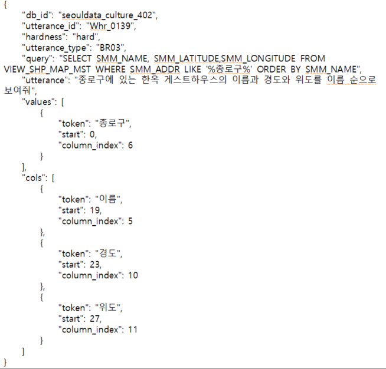

# NL2SQL Finetune
GPT 모델을 활용한 자연어 -> SQL 생성 작업

## Install
- Ubuntu 18.04
- Python 3.11.4
```bash
pip install -r requirements.txt
```

## Dataset
- [AI-Hub 자연어 기반 질의(NL2SQL) 검색 생성 데이터](https://www.aihub.or.kr/aihubdata/data/view.do?currMenu=&topMenu=&aihubDataSe=ty&dataSetSn=71351)
- 24.2MB
- 107,860개


### Preprocess Dataset
[nl2sql.json](./dataset/nl2sql/nl2sql.json)

## Train
```bash
python train.py
```

## Inference
```bash
python inference.py
```

## Reference
- [Llama 2 Fine-Tune with QLoRA](https://youtu.be/eeM6V5aPjhk?si=f_9LM0JmDTe2jlx1)

